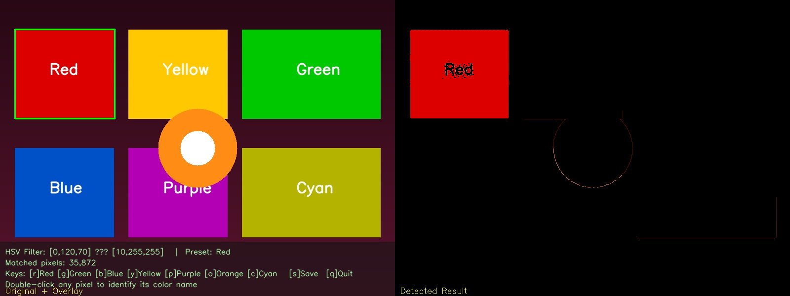
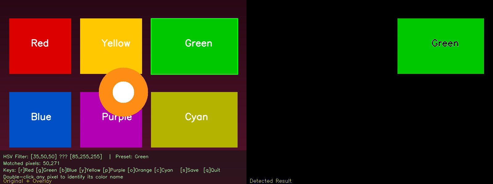
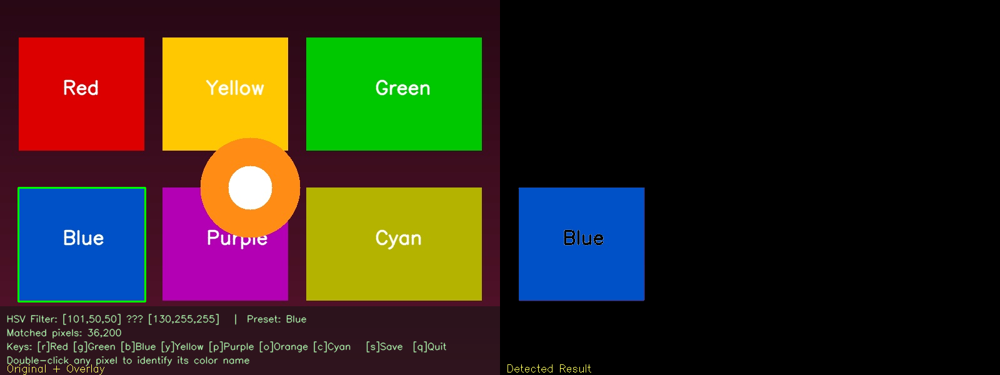

# 🎨 Color Detection App — Task 1

Identifies colors in images using two complementary techniques:

1. **Double-click** any pixel to identify its closest named color from a CSV color database using RGB Manhattan-distance matching.
2. **HSV trackbars** to isolate and highlight a selected color range across the image with live bounding boxes.

---

## Setup

Install the required libraries:

```bash
pip install opencv-python numpy pandas
```

---

## Usage

Run the application:

```bash
python color_detect.py --image pic2.jpg
```

Or specify a custom color database:

```bash
python color_detect.py --image pic2.jpg --csv colors.csv
```

---

## How It Works

### Technique 1 — Named Color Matching

When the user double-clicks on any pixel, the application reads its RGB values and compares them with all colors stored in `colors.csv`.

The closest color is determined using Manhattan Distance:

```text
distance = |R - csv_R| + |G - csv_G| + |B - csv_B|
```

The detected color name and RGB values are displayed in a banner at the top of the image.

### Technique 2 — HSV Range Filtering

The image is converted from BGR to HSV color space.

Using six trackbars:

- H Min / H Max
- S Min / S Max
- V Min / V Max

the user can define a color range. OpenCV's `cv2.inRange()` function generates a binary mask, and matching regions are highlighted with bounding boxes.

---

## Features

- RGB color name detection using a CSV database
- HSV-based color segmentation
- Interactive mouse double-click detection
- Adjustable HSV trackbars
- Real-time color masking
- Bounding boxes around detected regions
- Keyboard shortcuts for common color presets
- Screenshot saving functionality

---

## Keyboard Shortcuts

| Key | Action |
|-------|----------|
| `r` | Red preset |
| `g` | Green preset |
| `b` | Blue preset |
| `y` | Yellow preset |
| `p` | Purple preset |
| `o` | Orange preset |
| `c` | Cyan preset |
| `s` | Save screenshot |
| `q` / `Esc` | Quit application |
| Double-click | Identify pixel color |

---

## Project Files

| File | Description |
|------|-------------|
| `color_detect.py` | Main application |
| `colors.csv` | Color database containing named RGB colors |
| `pic2.jpg` | Sample image used for testing |
| `screenshot_1.png` | Red color detection demo |
| `screenshot_2.png` | Green color detection demo |
| `screenshot_3.png` | Blue color detection demo |

---

## Screenshots

### Red Detection



### Green Detection



### Blue Detection



---

## Technologies Used

- Python
- OpenCV
- NumPy
- Pandas

---

## Learning Outcomes

This project demonstrates:

- Color spaces (RGB and HSV)
- Image processing with OpenCV
- Pixel-level color analysis
- Mouse callback events
- HSV thresholding
- Contour detection and object highlighting
- Interactive computer vision applications

---

## Author

**Jai Singh**

Color Detection Project developed using Python, OpenCV, NumPy, and Pandas.
